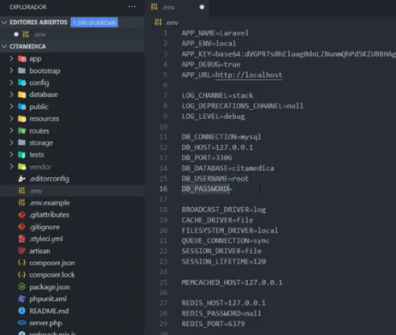
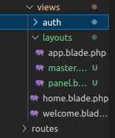
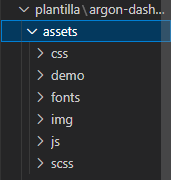
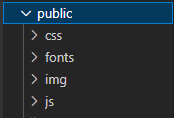
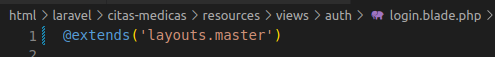
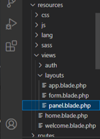
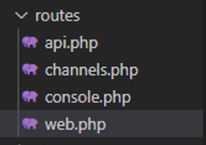
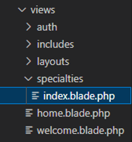
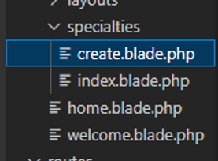
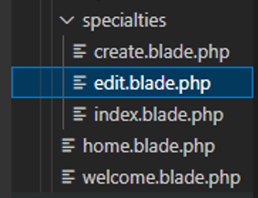

# Creamos el proyecto (1 video)

* composer create-project laravel/laravel citas-medicas

# subimos el proyecto a github
* git init
* git add -A
* git commit -m "inicio proyecto"
* git branch -M main
* git remote add origin https://github.com/Wladimirandrea/citas-medicas.git
* git push -u origin main

## Configuramos la base de datos (2 video)



## Instalamos sistema de autenticacion
* composer require laravel/ui
* php artisan ui vue --auth
* npm install && npm run dev
* npm run dev

## Hacemos la migracion de la base de datos
* php artisan migrate

## Creamos las vistas
    Resources > views > layouts > panel.blade.php
    Resources > views > layouts > master.blade.php



# Guardamos el proyecto a github
* git add -A
* git commit -m "2 video"
* git push -u origin main

## Copiamos los archivos de la plantilla (3 -video)
    Asset > ( css – fonts – img - js)


## Pegamos los archivos de la plantilla
    public > ( css – fonts – img - js)



## Remplazamos la dirección de los archivos
```
<link href="{{asset('img/brand/favicon.png')}}" rel="icon" type="image/png">
```

## Cambiamos el contenido de la vista Auth/Login
hacemos referencia a la vista padre (layouts.master)



## Cambiamos los atributos de los campos 

```
<input class="form-control" placeholder="Email" type="email" name="email" value="{{ old('email') }}" required autocomplete="email" autofocus>

<input id="password" type="password" class="form-control @error('password') is-invalid @enderror" name="password" required autocomplete="current-password">

<input class="custom-control-input" type="checkbox" name="remember" id="remember" {{ old('remember') ? 'checked' : '' }}>

```

## Modificamos el metodo Post

```
<form method="POST" action="{{ route('login') }}">
        @csrf
```

## Copiamos la ruta para recuperar la contraseña y registrar

```
<a href="{{ route('password.request') }}" class="text-light"><small>Forgot password?</small></a>
<a href="{{ route('register') }}" class="text-light"><small>Create new account</small></a>
```


## Creamos los mensajes de error
```
@if($errors->any())
    <div class="text-center text-muted mb-2">
        <h4>se encontro el siguiente error</h4>
    </div> 
    <div class="alert alert-danger mb-4" role="alert">
        {{$errors->first()}}
    </div>
@else
    <div class="text-center text-muted mb-4">
        <small>ingresa tus credenciales</small>
    </div> 
@endif
```

# Guardamos el proyecto a github
* git add -A
* git commit -m "3 video"
* git push -u origin main

## hacemos el registro (4 video)

## Copiamos y pegamos el archivo register de la plantilla example
```
view > auth > register.blade.php
```


## Modificamos los atibutos del registro
```
<input class="form-control" placeholder="Name" type="text" name="name" value="{{ old('name') }}" required autocomplete="name" autofocus>

<input class="form-control" placeholder="Email" type="email" name="email" value="{{ old('email') }}" required autocomplete="email">

<input class="form-control" placeholder="Password" type="password"  name="password" required autocomplete="new-password">
```
## Creamos un Nuevo campo para confirmar contraseña
```
<div class="form-group">
    <div class="input-group input-group-alternative">
    <div class="input-group-prepend">
        <span class="input-group-text"><i class="ni ni-lock-circle-open"></i></span>
    </div>
    <input class="form-control" placeholder="Password" type="password"  name="password_confirmation" required autocomplete="new-password">
    </div>
</div>
```
## Cambiamos el tipo del botón
```
<button type="submit" class="btn btn-primary mt-4">Create account</button>
```

## Cambiamos el tipo de formulario del registro
```
<form method="POST" action="{{ route('register') }}">
    @csrf
```

## Colocamos las notificaciones de error
```
@if($errors->any())
    <div class="text-center text-muted mb-2">
        <h4>se encotro el siguiente error</h4>
    </div> 
    <div class="alert alert-danger mb-4" role="alert">
        {{$errors->first()}}
    </div>
@else
    <div class="text-center text-muted mb-4">
        <small>ingresa tus credenciales</small>
    </div> 
@endif
```

## Creamos El panel administrativo (5video)
Copiamos la plantilla del dashboard a panel.blade.php



referenciamos la extension en home.blade.php
```
@extends('layouts.panel')
```

# Guardamos el proyecto a github
* git add -A
* git commit -m "3 video"
* git push -u origin main

## Creamos El menu lateral (6video)
creamos la carpeta includes/menu.blade.php
pegamos el menu lateral de la plantilla
hacemos referencia a los link del menu
<a class="nav-link " href="{{url('/especialidades')}}">
    <i class="ni ni-briefcase-24 text-blue"></i> Especialidades
</a>
hacemos el link de logout
<li class="nav-item">
    <a class="nav-link" href="{{route('logout')}}" onclick="event.preventDefault(); document.getElementById('formLogout').submit()">
        <i class="ni ni-button-power"></i> Cerrar sesion
    </a>
    <form action="{{route('logout')}}" method="POST" style="display: none;" id="formLogout">
            @csrf
    </form>
</li>

# Guardamos el proyecto a github
* git add -A
* git commit -m "6 video"
* git push -u origin main

## Creamos El footer (7video)
creamos la carpeta includes/footer.blade.php
pegamos el footer de la plantilla

# Guardamos el proyecto a github
* git add -A
* git commit -m "7 video"
* git push -u origin main

## Creamos El menu movil (8video)
creamos la carpeta includes/useroptions.blade.php
pegamos el menu movil de la plantilla

# Guardamos el proyecto a github
* git add -A
* git commit -m "8 video"
* git push -u origin main


## Creamos el modelo especialidad (video 9)
* php artisan make:model Specialty -mc

## Hacemos la migracion de speciality
```
 public function up()
    {
        Schema::create('specialties', function (Blueprint $table) {
            $table->increments('id');
            $table->string('name');
            $table->string('description')->nullable();
            $table->timestamps();
        });
    }
```
* php artisan migrate

## Creamos las rutas para especialidades


```
Route::get('/especialidades', [App\Http\Controllers\SpecialtyController::class, 'index']);
Route::get('/especialidades/create', [App\Http\Controllers\SpecialtyController::class, 'create']);
Route::get('/especialidades/{specialty}/edit', [App\Http\Controllers\SpecialtyController::class, 'edit']);
Route::post('/especialidades', [App\Http\Controllers\SpecialtyController::class, 'sendData']);
```

## creamos la funciones para el controlador
    public function __construct(){
        $this->middleware('auth');
    }
    public function index(){
        return view('specialties.index');
    }
## creamos la vista para especialidades



# Guardamos el proyecto a github
* git add -A
* git commit -m "9 video"
* git push -u origin main


## creamos el metodo crear para SpecialityController
 public function create(){
        return view('specialties.create');
    }

## creamos la vista create en la carpeta specialties


## Colocamos la ruta para el form de crear
```
<form method="POST" action="{{ url('/especialidades') }}">
    @csrf
```
## creamos el metodo para guardar los datos SpecialityController

    public function sendData(Request $request){
        $specialty = new Specialty();
        $specialty->name = $request->input('name');
        $specialty->description = $request->input('description');
        $specialty->save();
        return redirect('/especialidades');
    }

## importamos el modelo en el controlador

use App\Models\Specialty;

## creamos la lista de especialidades creadas

public function index(){
        $specialties = Specialty::all();
        return view('specialties.index', compact('$specialties'));
    }

## abrimos el archivo index de  la vista especialidades
    <tbody>
        @foreach ($specialties as $especialidad)
            <tr>
                <th scope="row">
                 {{$especialidad->name}}
                </th>
                <td>
                  {{$especialidad->description}}
                </td>
                
                <td>
                    <a href="" class="btn btn-sm btn-primary">Editar</a>
                    <a href="" class="btn btn-sm btn-danger">Eliminar</a>
                </td>
            </tr>
        @endforeach
    </tbody>

# Guardamos el proyecto a github
* git add -A
* git commit -m "10 video"
* git push -u origin main

## video 11

## hacemos reglas de validacion en el controlador en la funcion sendData

    public function sendData(Request $request){

        $rules = [
            'name' => 'required|min:3'
        ];
        $messages = [
            'name.required' => 'El nombre es obligatorio',
            'name.min' => 'el nombre debe ser 3 caracteres'
        ];
        $this->validate($request, $rules, $messages);

## colocamos el mensaje de error en el fomulario crear
    @if ($errors->any())
        @foreach ($errors->all() as $error)
            <div class="alert alert-danger" role="alert">
                <strong>Por favor</strong> {{$error}}
            </div>
        @endforeach        
    @endif

# Guardamos el proyecto a github
* git add -A
* git commit -m "11 video"
* git push -u origin main

## video 12
## creamos la funcion edit
   public function edit(Specialty $specialty){
        return view('specialties.edit', compact('specialty'));
    }

## creamos la vista edit


## copiamos la plantilla de create.blade.php

## colocamos los valores del input
    <input type="text" name="name" class="form-control" value="{{old('name', $specialty->name)}}">

    <input type="text" name="description" class="form-control" value="{{old('description', $specialty->description)}}">

## creamos una nueva ruta para editar los datos
    Route::put('/especialidades/{specialty}', [App\Http\Controllers\SpecialtyController::class, 'update']);

## creamos el metodo update

     public function update(Request $request, Specialty $specialty){

        $rules = [
            'name' => 'required|min:3'
        ];
        $messages = [
            'name.required' => 'El nombre es obligatorio',
            'name.min' => 'el nombre debe ser 3 caracteres'
        ];
        $this->validate($request, $rules, $messages);


        $specialty->name = $request->input('name');
        $specialty->description = $request->input('description');
        $specialty->save();
        return redirect('/especialidades');
    }

## modificar el formulario edit
        <form method="POST" action="{{ url('/especialidades/'.$specialty->id) }}">
                @csrf
                @method('PUT')

## creamos la ruta para eliminar
    Route::delete('/especialidades/{specialty}', [App\Http\Controllers\SpecialtyController::class, 'destroy']);

## hacemos la funcion destroy

    public function destroy(Specialty $specialty){
        $specialty->delete();
        return redirect('/especialidades');
    }

## modificamos el link de eliminar en el index

    <form action="{{url('/especialidades/'.$especialidad->id)}}" method="POST">
        @csrf
        @method('DELETE')
        <a href="{{url('/especialidades/'.$especialidad->id.'/edit')}}" class="btn btn-sm btn-primary">Editar</a>
        <button type="submit" class="btn btn-sm btn-danger">Eliminar</button>
    </form>

# Guardamos el proyecto a github
* git add -A
* git commit -m "12 video"
* git push -u origin main

## video 13
## creamos notificaciones para guardar y editar los registros
        $specialty->save();

        $notification = 'la especialidad se ha creado correctamente';
        return redirect('/especialidades')->with(compact('notification'));

## colocamos la notificacion en el index
        <div class="card-body">
          @if (session('notification'))
            <div class="alert alert-success" role="alert">
              {{session('notification')}}
            </div>
          @endif
        </div>

# Guardamos el proyecto a github
* git add -A
* git commit -m "13 video"
* git push -u origin main

# video 14
# creamos la pagina de los medicos

## modificamos la migracion de la tabla usuarios
    ```
    $table->string('cedula');
    $table->string('address')->nullable();
    $table->string('phone')->nullable();
    $table->string('role');
    ```
## creamos la ruta para los medicos

   Route::resource('medicos', 'App\Http\Controllers\DoctorController');
## creamos el controlador
    php artisan make:controller DoctorController --resource
## creamos las vistas para doctores
    views/doctors

# modificamos el methodo en DoctorController
    public function index()
    {
        $doctors = User::all();
        return view('doctors.index', compact('doctors'));
    }

# Guardamos el proyecto a github
* git add -A
* git commit -m "13 video"
* git push -u origin main


# video 15

## creamos la ruta para los pacientes

   Route::resource('medicos', 'App\Http\Controllers\PatientController');

## creamos el controlador
    php artisan make:controller PatientController --resource

## creamos las vistas para doctores
    views/patients

# modificamos el methodo en DoctorController
    
public function index()
    {
        $patients = User::all();
        return view('patients.index', compact('patients'));
    }


    public function create()
    {
        return view('patients.create');
    }

# Guardamos el proyecto a github
* git add -A
* git commit -m "15 video"
* git push -u origin main


# video 16
# creamos datos falso para los useroptions

    php artisan migrate:refresh --seed

# carpeta factories/ UserFactories

agregamos los nuevos campos a la tabla useroptions
    'cedula' => $this->faker->randomNumber(8, true),
    'address' => $this->faker->address(),
    'phone' => $this->faker->tollFreephoneNumber(),
    'role' => $this->faker->randomElement(['paciente', 'doctor']),

## creamos un nuevo seeder
    php artisan make:seeder UserstableSeeder

## modificamos el archivo seeder database/seeders/UserstableSeeder
## para crear un primer usuario admin

        User::create([
            'name' => 'Wladimir',
            'email' => 'wladimirandrea@gmail.com',
            'email_verified_at' => now(),
            'password' => bcrypt('123456789'), // password
            'cedula' => '17373687',
            'address' => 'calle 11',
            'phone' => '3024232053',
            'role' => 'admin',
        ]);
        User::factory()->count(50)->create();
## llamamos al seeders/databaseSeeder
    $this->call(UserstableSeeder::class);

## ejecutamos el comando para llamar al seeder
    php artisan db:seed


# Guardamos el proyecto a github
* git add -A
* git commit -m "16 video"
* git push -u origin main

# video 17

## filtramos los datos de los usuario por role
 app/http/models/User.php

    public function scopePatients($query){
        return $query->where('role','paciente');
    }
    public function scopeDoctors($query){
        return $query->where('role','doctor');
    }


## cambiamos la funcion en PatientController
    $patients = User::all();

    por

    $patients = User::patients()->get();


## cambiamos la funcion en DoctorController
    $doctors = User::all();

    por
     
    $doctors = User::doctors()->get();


# Guardamos el proyecto a github
* git add -A
* git commit -m "17 video"
* git push -u origin main

# video 18

## creamos editamos eliminamos registro de medicos

## modificamos la function store en doctorcontroller

public function store(Request $request)
    {
        $rules = [
            'name' => 'required|min:3',
            'email' => 'required|email',
            'cedula' => 'required|min:5',
            'address' => 'nullable|min:6',
            'phone' => 'required',
        ];
        $messages = [
            'name.required' => 'el nombre del medico es obligatorio',
            'name.min' => 'el nombre del medico debe tener mas de 3 caracteres',
            'email.required' => 'el correo electronico es obligatorio',
            'email.email' => 'ingresa un correo electronico valido',
            'cedula.required' => 'la cedula es obligatorio',
            'cedula.digits' => 'la cedula debe tener al menos 5 digitos',
            'name.required' => 'el nombre del medico es obligatorio',
            'address.min' => 'la direccion debe tener al menos de 5 caracteres',
            'phone.required' => 'el numero de telefono es obligatorio',
        ];
        $this->validate($request, $rules, $messages);
        User::create(
            $request->only('name','email','cedula','address','phone')
            + [
                'role' => 'doctor',
                'password' => bcrypt($request->input('password'))
            ]
        );
        $notification = 'El medico se ha registrado correctamente';
        return redirect('/medicos')->with(compact('notification'));
    }
## abrimos el modelo user models/user
protected $fillable = [
        'name',
        'email',
        'password',
        'cedula',
        'address',
        'phone',
        'role',
    ];

## agregamos el campo password en doctors/create
    <div class="form-group">
        <label for="password">Telefono</label>
        <input type="text" name="password" class="form-control" value="{{old('password', Srt::random(8))}}" required>
    </div>

## copiamos la ruta para genera el password
<?php
    use Illuminate\Support\Str;
?>

@extends('layouts.panel')

## creamos la vista para editar los medicos
 view/doctors/edit.blade.php
 copiamos la misma vista de create.blade

## editamos el metodo
    <form method="POST" action="{{ url('/medicos/'.$doctor->id) }}">
                @csrf
                @method('PUT')
## editamos los input de los campos
    <input type="text" name="name" class="form-control" value="{{old('name', $doctor->name)}}" >

## creamos la funcion para editar
public function edit($id)
    {
        $doctor = User::doctors()->findorfail($id);
        return view('doctors.edit', compact('doctor'));
    }

    public function update(Request $request, $id)
    {
        $rules = [
            'name' => 'required|min:3',
            'email' => 'required|email',
            'cedula' => 'required|min:5',
            'address' => 'nullable|min:6',
            'phone' => 'required',
        ];
        $messages = [
            'name.required' => 'el nombre del medico es obligatorio',
            'name.min' => 'el nombre del medico debe tener mas de 3 caracteres',
            'email.required' => 'el correo electronico es obligatorio',
            'email.email' => 'ingresa un correo electronico valido',
            'cedula.required' => 'la cedula es obligatorio',
            'cedula.digits' => 'la cedula debe tener al menos 5 digitos',
            'name.required' => 'el nombre del medico es obligatorio',
            'address.min' => 'la direccion debe tener al menos de 5 caracteres',
            'phone.required' => 'el numero de telefono es obligatorio',
        ];
        $this->validate($request, $rules, $messages);
        $user = User::doctors()->findorfail($id);
        $data = $request->only('name','email','cedula','address','phone');
        $password = $request->input('password');
        if($password)
            $data['password'] = bcrypt($password);
        $user->fill($data);
        $user->save();
        $notification = 'El medico se ha actualizado correctamente';
        return redirect('/medicos')->with(compact('notification'));
    }
## creamos el metodo para borrar
public function destroy($id)
    {
        $user = User::doctors()->findOrFail($id);
        $doctorName = $user->name;
        $user->delete();
        $notification = "El medico $doctorName Se elimino correctamente";
        return redirect('/medicos')->with(compact('notification'));
    }


# Guardamos el proyecto a github
* git add -A
* git commit -m "17 video"
* git push -u origin main


# video 19

## creamos editamos eliminamos registro de pacientes


## modificamos la function store en Patientcontroller

    public function store(Request $request)
    {
        $rules = [
            'name' => 'required|min:3',
            'email' => 'required|email',
            'cedula' => 'required|min:5',
            'address' => 'nullable|min:6',
            'phone' => 'required',
        ];
        $messages = [
            'name.required' => 'el nombre del paciente es obligatorio',
            'name.min' => 'el nombre del paciente debe tener mas de 3 caracteres',
            'email.required' => 'el correo electronico es obligatorio',
            'email.email' => 'ingresa un correo electronico valido',
            'cedula.required' => 'la cedula es obligatorio',
            'cedula.digits' => 'la cedula debe tener al menos 5 digitos',
            'name.required' => 'el nombre del paciente es obligatorio',
            'address.min' => 'la direccion debe tener al menos de 5 caracteres',
            'phone.required' => 'el numero de telefono es obligatorio',
        ];
        $this->validate($request, $rules, $messages);
        User::create(
            $request->only('name','email','cedula','address','phone')
            + [
                'role' => 'paciente',
                'password' => bcrypt($request->input('password'))
            ]
        );
        $notification = 'El paciente se ha registrado correctamente';
        return redirect('/pacientes')->with(compact('notification'));
    }


## agregamos el campo password en patients/create
    <div class="form-group">
        <label for="password">Telefono</label>
        <input type="text" name="password" class="form-control" value="{{old('password', Srt::random(8))}}" required>
    </div>

## copiamos la ruta para genera el password
<?php
    use Illuminate\Support\Str;
?>

@extends('layouts.panel')

## creamos la vista para editar los pacientes
 view/patients/edit.blade.php
 copiamos la misma vista de create.blade

## editamos el metodo
    <form method="POST" action="{{ url('/pacientes/'.$patient->id) }}">
                @csrf
                @method('PUT')
## editamos los input de los campos
    <input type="text" name="name" class="form-control" value="{{old('name', $patient->name)}}" >

## creamos la funcion para editar
    public function edit($id)
    {
        $patient = User::patients()->findorfail($id);
        return view('patients.edit', compact('patient'));
    }

    public function update(Request $request, $id)
     {
        $rules = [
            'name' => 'required|min:3',
            'email' => 'required|email',
            'cedula' => 'required|min:5',
            'address' => 'nullable|min:6',
            'phone' => 'required',
        ];
        $messages = [
            'name.required' => 'el nombre del paciente es obligatorio',
            'name.min' => 'el nombre del paciente debe tener mas de 3 caracteres',
            'email.required' => 'el correo electronico es obligatorio',
            'email.email' => 'ingresa un correo electronico valido',
            'cedula.required' => 'la cedula es obligatorio',
            'cedula.digits' => 'la cedula debe tener al menos 5 digitos',
            'name.required' => 'el nombre del paciente es obligatorio',
            'address.min' => 'la direccion debe tener al menos de 5 caracteres',
            'phone.required' => 'el numero de telefono es obligatorio',
        ];
        $this->validate($request, $rules, $messages);
        $user = User::patients()->findorfail($id);
        $data = $request->only('name','email','cedula','address','phone');
        $password = $request->input('password');
        if($password)
            $data['password'] = bcrypt($password);
        $user->fill($data);
        $user->save();
        $notification = 'El paciente se ha actualizado correctamente';
        return redirect('/pacientes')->with(compact('notification'));
    }
## creamos el metodo para borrar
    public function destroy($id)
     {
        $user = User::patients()->findOrFail($id);
        $patientName = $user->name;
        $user->delete();
        $notification = "El paciente $patientName Se elimino correctamente";
        return redirect('/pacientes')->with(compact('notification'));
    }


# Guardamos el proyecto a github
* git add -A
* git commit -m "17 video"
* git push -u origin main
